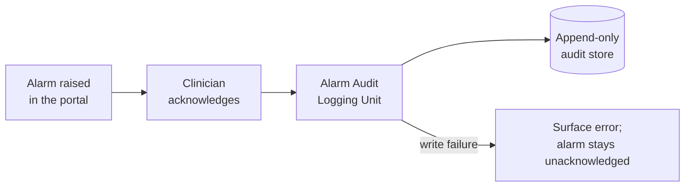

# Alarm Audit Logging Unit

## Purpose

The Alarm Audit Logging Unit records the fact that a clinician
acknowledged an alarm, so that the acknowledgement is reconstructable
after the fact. It exists to satisfy the alarm acknowledgement audit
requirement and is treated as safety-related because the record is the
only evidence that a clinician saw and dismissed an alarm condition.

## Design description

The unit exposes `recordAcknowledgement()`, invoked by the alarm banner
when a clinician dismisses an active alarm. It writes a single immutable
entry containing the acknowledging user id, the alarm identifier, the
alarm's originating subsystem, and the acknowledgement timestamp taken
from the server clock rather than the browser.

Entries are append-only. The unit exposes no update or delete path, and
a write failure is surfaced to the caller rather than swallowed - an
alarm that cannot be recorded as acknowledged must not appear
acknowledged in the interface.

The entry schema deliberately carries only the fields the requirement
names. Additional operator context is out of scope here and belongs to
the general telemetry access log handled by the Audit Log Unit.

## Interfaces

- Consumes: acknowledgement events from the alarm banner component.
- Produces: append-only audit entries in the portal audit store.

## Diagram

