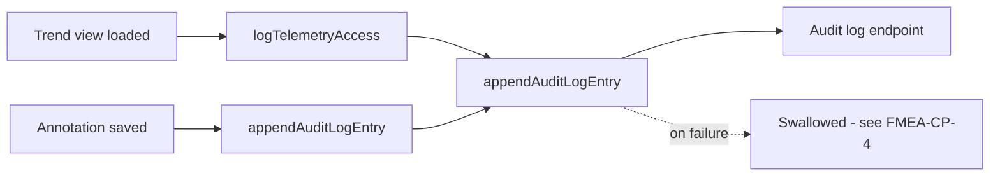

# Audit Log Unit

## Purpose

The Audit Log Unit records every clinician access to patient telemetry,
including trend views and annotations, so there is an accountable record
of who viewed or acted on what data and when (SWR-CP-5).

## Design description

The unit exposes `appendAuditLogEntry()`, called from both the trend
retrieval path (via `logTelemetryAccess()`, capturing the accessed date
range) and the Clinician Annotation Panel (every saved note is treated
as a telemetry access event for audit purposes, in addition to being a
content write). Each entry captures clinician id, patient id, an action
label, a timestamp, and - where applicable - the accessed record range.

This demo implementation deliberately illustrates FMEA-CP-4: the write
to the audit log endpoint is wrapped in a try/catch that swallows
failures rather than surfacing or retrying them. In a real
implementation this would be a defect, not a feature - it exists here so
the failure mode ("audit log write fails silently, losing the
access-accountability record") has a concrete line of code a reviewer
can point to, rather than being purely a paper risk-analysis entry.

The unit intentionally has no read path in this repository; audit log
review/export is treated as a separate reporting concern outside the
demo's scope.

## Interfaces

- Consumes: access events from the Telemetry Retrieval Unit (via
  `logTelemetryAccess`) and the Clinician Annotation Panel.
- Produces: POSTs to the portal's audit-log endpoint (demo stub URL).

## Diagram

