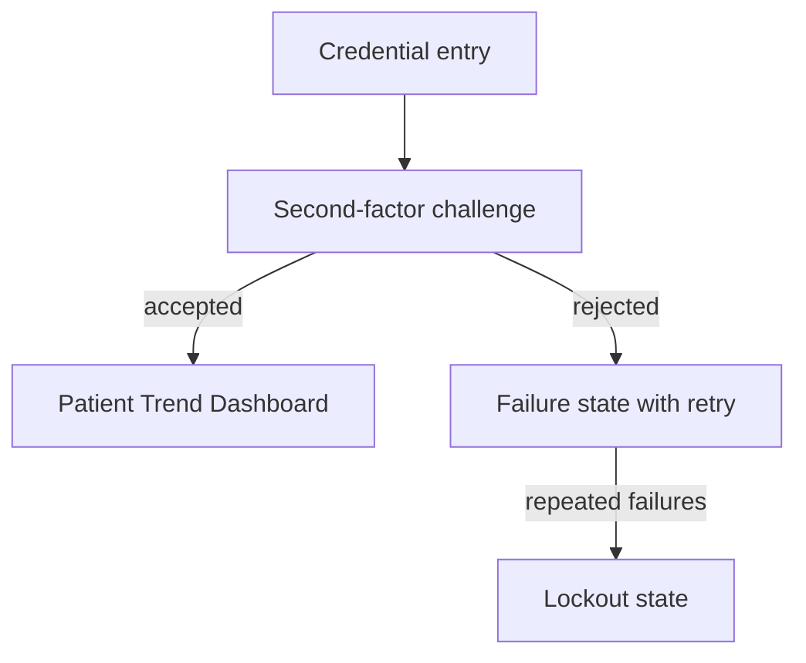

# Clinician Authentication Screen GUI Spec

## Component

The authentication screen a clinician passes through before any patient
telemetry is displayed. Covers credential entry, the second-factor
challenge, and the failure and lockout states.

## Layout

## Behavior

| Element | Required behavior | Satisfies |
| --- | --- | --- |
| Credential entry | Accepts clinician credentials. No patient data is present anywhere in the page before authentication completes. | Require MFA before displaying patient telemetry |
| Second-factor challenge | Always presented. It cannot be skipped, deferred, or remembered across sessions. | Require MFA before displaying patient telemetry |
| Failure state | States that authentication failed without revealing which factor was wrong. | Require MFA before displaying patient telemetry |
| Lockout state | After repeated failures, entry is blocked and the event is written to the audit log. | Require MFA before displaying patient telemetry |

## Notes

The screen is a risk control surface, not a convenience feature. The
"cannot be remembered across sessions" rule exists so a shared
workstation cannot become an unauthenticated path to patient telemetry.
