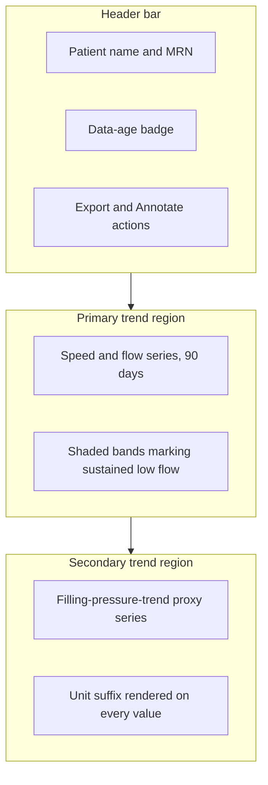
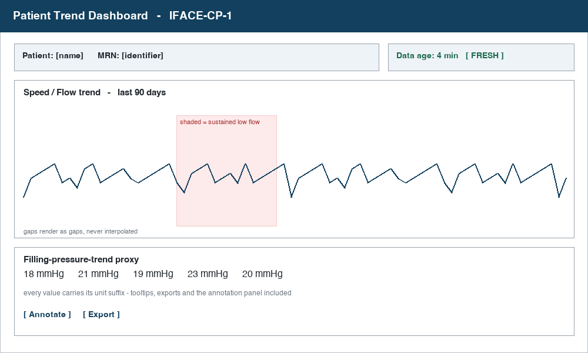

# Patient Trend Dashboard GUI Spec

## Component

Patient Trend Dashboard (IFACE-CP-1). The clinician-facing screen that
presents 90 days of pump telemetry for a single patient. This spec
defines what the screen must show and how each element behaves. It does
not define pixel geometry, typography, or color - those live in the
design system and are deliberately out of scope here.

## Layout

## Reference

The wireframe defines what the screen must show and how elements relate.
It is not a pixel-accurate mock; layout, typography and color live in the
design system.

## Behavior

| Element | Required behavior | Satisfies |
| --- | --- | --- |
| Trend region | Displays the most recent 90 days of speed and flow retrieved from the telemetry gateway. Ranges with no data render as gaps, never as interpolated lines. | Display 90-day trend |
| Low-flow shading | Any period where estimated flow trends below the sustained low-flow threshold is shaded and labeled. Shading is a visual flag for review, not an alarm. | Flag sustained low-flow trend |
| Pressure-trend proxy | Every displayed value carries its unit suffix. A value may never render bare, including in tooltips, exports, and the annotation panel. | Display filling-pressure-trend proxy with correct units |
| Data-age badge | Shows the age of the newest sample. Switches to a stale treatment once data exceeds the freshness window. | Display 90-day trend |

## Notes

The unit-suffix rule is the surface where FMEA-CP-1 materializes. An
unlabeled proxy value can be misread as a different scale entirely, so
the requirement is stated here as an absolute rather than a default.

Rendering logic for this screen lives in the Trend Chart Rendering Unit
(unit-cp-2). This spec governs what a clinician sees; that unit governs
how it is drawn.
