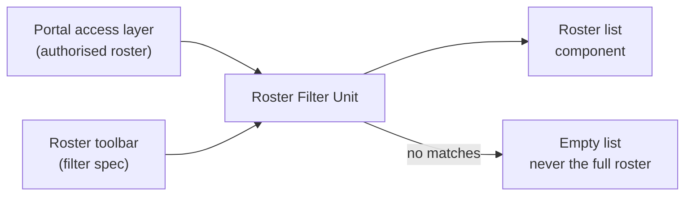

# Roster Filter Unit

## Purpose

The Roster Filter Unit narrows the multi-patient roster to the subset a
clinician wants to act on. It is presentation-side filtering only; it
never changes which patients a clinician is authorised to see.

## Design description

The unit exposes `applyRosterFilter()`, taking the authorised patient
roster and a filter specification. The specification supports filtering
by assigned clinician and by alarm status. Grouping by care team is
explicitly not supported - it was considered during design and
descoped before baseline, and the approved requirement covers assigned
clinician only.

Filtering is applied to the already-authorised roster returned by the
portal's access layer. The unit cannot widen a roster: a filter that
matches nothing returns an empty list rather than falling back to the
unfiltered set, so a filtering bug can never expose a patient a
clinician is not entitled to see.

Filter state is held per session so it survives navigation within the
portal, and is cleared on sign-out.

## Interfaces

- Consumes: the authorised patient roster from the portal access layer.
- Consumes: a filter specification from the roster toolbar.
- Produces: the filtered roster consumed by the roster list component.

## Diagram

