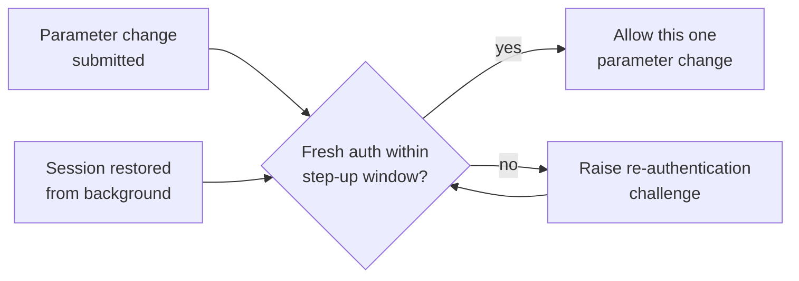

# Step-Up Authentication Unit

## Purpose

The Step-Up Authentication Unit forces a clinician to re-authenticate
immediately before a pump parameter change is submitted. It is the
control that prevents an unattended or restored session from being used
to alter therapy.

## Design description

The unit exposes a guard, `requireStepUp()`, which the parameter-change
flow must call before submission. The guard evaluates whether a fresh
authentication has occurred within the step-up window; if not, it
raises a re-authentication challenge and blocks submission until the
challenge is satisfied.

The guard is evaluated at the point of submission, not at the point the
form is opened - a form left open past the window must still challenge.
Equally, restoring a backgrounded session must re-evaluate the guard
rather than re-hydrating the previous authentication context, since a
restored session carries no evidence that the same clinician is present.

A satisfied challenge authorises exactly one parameter change. The unit
does not issue a reusable elevated session.

## Interfaces

- Consumes: submission attempts from the pump parameter change flow.
- Consumes: authentication state from the portal identity provider.
- Produces: an allow or block decision, and a re-authentication challenge.

## Diagram

