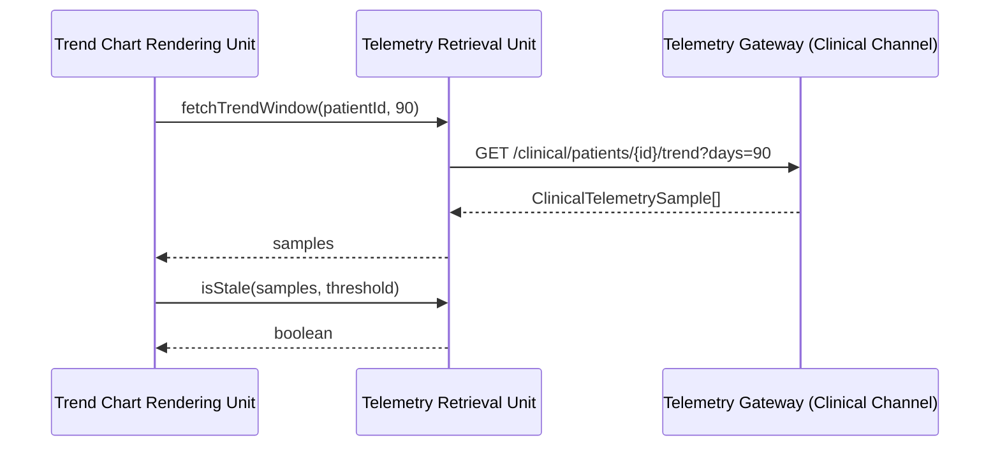

# Telemetry Retrieval Unit

## Purpose

The Telemetry Retrieval Unit is the Clinician Portal's client for the
Device Telemetry Gateway API's Clinical Channel. It retrieves historical
pump trend data for a selected patient so the rest of the portal never
talks to the gateway directly.

## Design description

The unit exposes a single retrieval entry point, `fetchTrendWindow()`,
parameterized by patient id and a window length in days (illustrative
default 90, per SWR-CP-1). It calls the clinical-channel endpoint
described in `telemetry-gateway/api-spec.yaml` and returns a typed array
of samples containing speed, flow estimate, and the filling-pressure-
trend proxy - the same fields the Pump Controller's Telemetry Publisher
Unit produces on that channel.

A secondary responsibility is freshness detection: `isStale()` compares
the timestamp of the most recent retrieved sample against a caller-
supplied max-age threshold. This exists to support TASK-CP-3 (the
freshness/data-age badge added to close FMEA-CP-3, where stale telemetry
could otherwise be displayed to a clinician with no indication it was
stale). The unit does not decide on its own how staleness should be
communicated in the UI - that decision belongs to the Trend Chart
Rendering Unit, which consumes this helper.

Error handling is intentionally simple for this demo: a non-2xx response
throws, and callers are expected to handle retrieval failure themselves
rather than the unit silently returning partial or empty data.

## Interfaces

- Consumes: Device Telemetry Gateway API - Clinical Channel (via HTTP,
  see telemetry-gateway/api-spec.yaml).
- Produces: `ClinicalTelemetrySample[]`, consumed by the Trend Chart
  Rendering Unit.
- Produces: staleness boolean, consumed by the Trend Chart Rendering Unit
  for the data-age badge.

## Diagram

