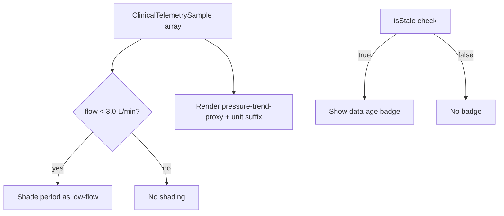

# Trend Chart Rendering Unit

## Purpose

The Trend Chart Rendering Unit renders the Patient Trend Dashboard
(IFACE-CP-1): a multi-series chart of speed, flow, and filling-pressure-
trend-proxy data, with sustained low-flow periods visually flagged for
clinician review.

## Design description

The unit consumes samples from the Telemetry Retrieval Unit and derives
two things from them for display. First, it flags any period where
estimated flow trends below an illustrative 3.0 L/min threshold
(`SUSTAINED_LOW_FLOW_THRESHOLD_L_PER_MIN`, SWR-CP-2) by shading that
region of the speed/flow series. This threshold is intentionally a
separate constant from the pump controller firmware's own
`LOW_FLOW_ALARM_THRESHOLD` (2.5 L/min, SWR-PCF-3) - they reference the
same underlying physiological boundary but live in different subsystems
with no direct trace link between them. When SWR-PCF-3's threshold
changes, this constant is a same-domain ripple candidate worth reviewing
for consistency, even though nothing forces that review automatically.

Second, the unit renders the filling-pressure-trend proxy series with
its unit suffix displayed alongside every value (SWR-CP-3), since the
proxy value is only meaningful to a clinician when correctly labeled
with its illustrative unit (mmHg in this demo). This is the surface
where FMEA-CP-1 materializes if the unit label is ever dropped - a
clinician could misread an unlabeled number as a different scale
entirely, mistaking a normal reading for an outlier or vice versa.

Finally, the unit surfaces the data-age badge computed by the Telemetry
Retrieval Unit's `isStale()` check, addressing FMEA-CP-3 (stale data
shown without a freshness indicator).

## Interfaces

- Consumes: `ClinicalTelemetrySample[]` and staleness flag from the
  Telemetry Retrieval Unit.
- Produces: rendered Patient Trend Dashboard (IFACE-CP-1): shaded
  low-flow periods, unit-labeled pressure-trend series, data-age badge.

## Diagram

