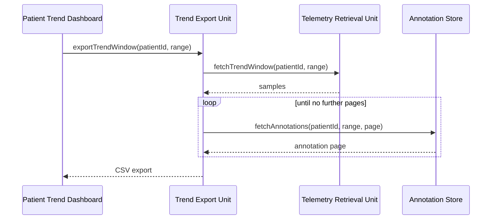

# Trend Export Unit

## Purpose

The Trend Export Unit produces an offline copy of a patient's trend
record so a clinician can review it away from the portal, or attach it
to a case note. It is the only component permitted to serialise clinical
telemetry out of the application boundary.

## Design description

The unit exposes `exportTrendWindow()`, parameterised by patient id and
a date range. It assembles three inputs: the telemetry samples supplied
by the Telemetry Retrieval Unit, the clinician annotations held against
that window, and a header block carrying patient identifier, export
timestamp and the exporting clinician.

Annotations are fetched through a paginated query. Each page must be
consumed before serialisation begins - a partial read silently produces
an export that looks complete but is missing annotation rows, which is
the failure mode recorded against this unit during verification.

Export format is CSV for the demo. The header block is emitted as
comment rows so the payload remains machine-readable, and the sample
rows carry the same field set the Telemetry Retrieval Unit returns, in
the units the Trend Chart Rendering Unit displays them - no unit
conversion happens here.

## Interfaces

- Consumes: `ClinicalTelemetrySample[]` from the Telemetry Retrieval Unit.
- Consumes: annotation records via the paginated annotation query.
- Produces: a CSV export stream returned to the browser.

## Diagram

