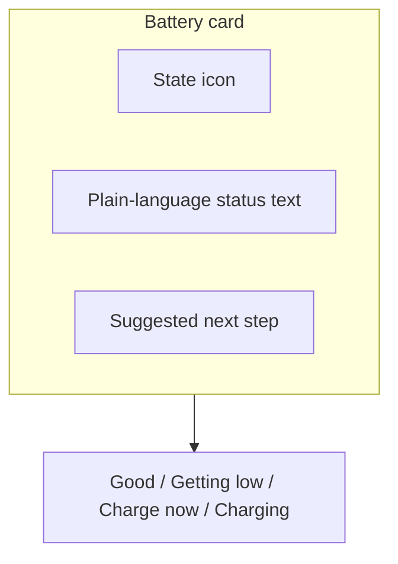

# Battery Status Indicator GUI Spec

## Component

The battery status indicator in the patient companion app. Communicates
remaining device power to a patient in plain language, without clinical
framing.

## Layout

## Behavior

| Element | Required behavior | Satisfies |
| --- | --- | --- |
| Status text | Drawn only from the approved plain-language vocabulary. No percentages, no voltages, no runtime estimates presented as predictions. | Plain-language battery status indicator |
| State icon | Matches the status text. Icon and text can never disagree. | Plain-language battery status indicator |
| Suggested next step | Tells the patient what to do, not what the device is doing internally. | Plain-language battery status indicator |
| Classification boundary | The card renders from the non-clinical telemetry channel only. No clinical field may be read by this component. | No clinical data surfaced (classification-boundary control) |

## Notes

This component sits on the non-medical side of the classification
boundary. The vocabulary constraint is what keeps it there: a runtime
estimate framed as a prediction would read as clinical guidance and pull
the component back across the line.
