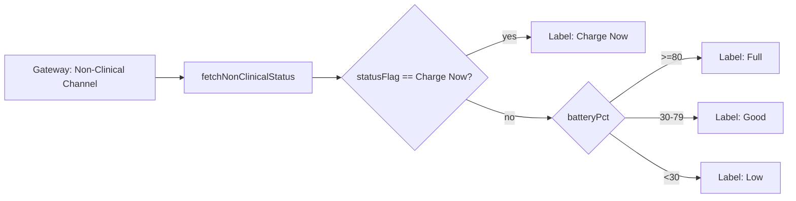

# Battery Status Widget Unit

## Purpose

The Battery Status Widget Unit gives the patient a plain-language
battery status (Full / Good / Low / Charge Now) without requiring any
clinical interpretation, satisfying UN-3 (plain-language device status
for patient/caregiver).

## Design description

The widget fetches the current non-clinical status from the Device
Telemetry Gateway API's Non-Clinical Channel via
`nonClinicalTelemetryClient.ts`, and maps the returned battery percentage
and coarse status flag to one of four plain-language labels. The mapping
deliberately gives the gateway's own "Charge Now" status flag priority
over the percentage-based thresholds, since the flag reflects the pump
controller's own judgment about urgency and should not be second-guessed
by a simpler percentage cutoff on the app side.

This unit is also one half of the classification-boundary control for
SWR-PCA-5 ("no clinical data surfaced"): the `NonClinicalStatus` type it
consumes has no field capable of carrying speed, flow, pressure, or
alarm data in the first place, so there is no code path in this widget
that could leak clinical data even by mistake. The enforcement lives one
layer down, in the shared telemetry client and, ultimately, in the
Device Telemetry Gateway's Non-Clinical Channel contract itself.

## Interfaces

- Consumes: `NonClinicalStatus` (battery %, status flag) from
  `nonClinicalTelemetryClient.ts`.
- Produces: rendered plain-language battery label (Full/Good/Low/Charge
  Now) in the companion app UI.

## Diagram

