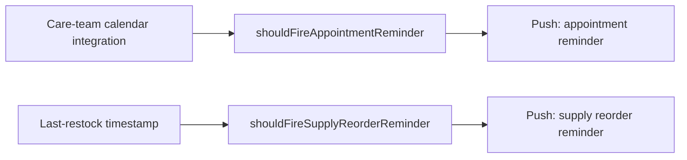

# Reminder Scheduling Unit

## Purpose

The Reminder Scheduling Unit helps the patient manage day-to-day device
logistics - upcoming appointments and consumable supply reorder - so
that logistics burden does not fall entirely on the patient's memory
(UN-4).

## Design description

The unit has two independent scheduling rules. Appointment reminders
(SWR-PCA-2) fire within a configurable lead window (illustrative default
24 hours) before an appointment pulled from the care-team calendar
integration; the calendar integration itself is out of scope for this
repository. Supply reorder reminders (SWR-PCA-4) fire based on simple
elapsed-time logistics rules per supply type - illustrative default
intervals of 90 days for batteries and 14 days for dressing kits - rather
than any usage-based depletion model, since usage-based tracking would
require clinical-adjacent telemetry this subsystem does not have access
to.

Both reminder types are deliberately simple, stateless calculations
(`shouldFireAppointmentReminder`, `shouldFireSupplyReorderReminder`)
rather than a persistent scheduler service, to keep this unit's behavior
easy to unit test against fixed timestamps. A calling layer (not modeled
in this repo) is expected to poll these functions on a periodic cadence
and surface push notifications when they return true.

## Interfaces

- Consumes: appointment records from the care-team calendar integration
  (not modeled in this repo); last-restock timestamps per supply type
  (source not modeled in this repo).
- Produces: boolean reminder-should-fire signals, consumed by the
  companion app's notification layer (not modeled in this repo).

## Diagram

