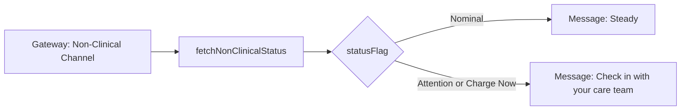

# Trends Widget Unit

## Purpose

The Trends Widget Unit gives the patient a simplified, explicitly
non-diagnostic sense of how they are trending ("Steady" or "Check in
with your care team"), without exposing any clinical value or
interpretation that would require a clinician (SWR-PCA-3).

## Design description

The widget maps the non-clinical status flag from the Device Telemetry
Gateway's Non-Clinical Channel directly to one of exactly two wellness
messages. There is no percentage-based nuance here, unlike the Battery
Status Widget Unit - the wellness message is intentionally coarse and
binary, to avoid any appearance of clinical diagnosis or trend analysis
happening on the patient's device. If the status flag is anything other
than "Nominal," the widget always shows the same "check in with your
care team" message rather than trying to characterize how serious the
underlying condition is.

This is the second half of the SWR-PCA-5 enforcement pattern shared with
the Battery Status Widget Unit: the widget has no code path that could
consume clinical data, because the only data source available to it -
the Non-Clinical Channel - never carries any. Version 1.1 (v1, shipped)
covers this single-flag mapping; the v2 comparison view planned for
TASK-PCA-3 adds a historical view of past wellness messages but does not
change what data feeds it.

## Interfaces

- Consumes: `NonClinicalStatus.statusFlag` from
  `nonClinicalTelemetryClient.ts`.
- Produces: rendered wellness message ("Steady" / "Check in with your
  care team") in the companion app UI.

## Diagram

