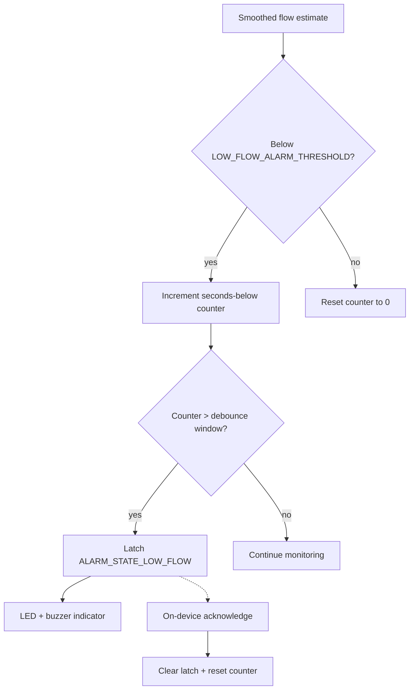

# Alarm Management Unit

## Purpose

The Alarm Management Unit detects sustained low-flow conditions and
latches a Low Flow Alarm that drives the on-device LED and buzzer
indicator (IFACE-PCF-2). It is the firmware-side control for HAZ-2
(inflow occlusion / suction event).

## Design description

The unit is fed the smoothed flow estimate from the Flow Estimation Unit
at 1 Hz. On each update, it compares the estimate against
`LOW_FLOW_ALARM_THRESHOLD` (illustrative 2.5 L/min, expressed internally
as 250 in L/min x100 fixed-point units, matching the Flow Estimation
Unit's representation). A simple counter tracks consecutive seconds spent
below threshold; once that counter exceeds the debounce window
(illustrative 10 seconds), the alarm latches into `ALARM_STATE_LOW_FLOW`.

The debounce exists to avoid nuisance alarms from a brief, transient dip
in the flow estimate (for example during a patient position change) while
still catching a genuine sustained occlusion within a clinically
reasonable window. Once latched, the alarm state persists regardless of
subsequent flow readings until explicitly acknowledged on-device via
`alarm_manager_acknowledge()` - this acknowledgment path is deliberately
device-local only and is not exposed through the telemetry gateway to
either the Clinician Portal or the Patient Companion App (see UC-3: the
low-flow alarm response stays entirely on the medical device).

The alarm threshold constant is a controlled requirement value, not an
implementation detail: it is the direct expression of SWR-PCF-3's
"below 2.5 L/min for more than 10 seconds" wording, and any change to
that requirement is expected to flow through as a change to this
constant, with corresponding re-verification of TC-PCF-3 and TC-SYS-2.

## Interfaces

- Consumes: smoothed flow estimate (L/min x100) from the Flow Estimation
  Unit, at 1 Hz.
- Produces: latched alarm state, read by the on-device LED/buzzer driver
  (IFACE-PCF-2).
- Produces: (implicitly) the trigger for clinical-channel alarm event
  telemetry via the Telemetry Publisher Unit.

## Diagram

