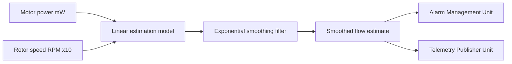

# Flow Estimation Unit

## Purpose

The Flow Estimation Unit computes an estimated pump flow rate from motor
power and speed telemetry, since the platform does not use a direct
in-line flow sensor. Its output feeds both the Alarm Management Unit
(low-flow detection) and the Telemetry Publisher Unit (clinical channel).

## Design description

At an illustrative 1 Hz update rate, the unit takes the latest motor
power draw (milliwatts) and rotor speed (RPM x10, from the Motor Drive
Control Unit) and applies a linear estimation model to produce a flow
estimate in L/min x100 fixed-point units. The model coefficients used in
this demo are illustrative only and are not derived from any bench
characterization of a real device.

Because a single noisy sample feeding directly into the low-flow alarm
path could cause spurious alarms, the raw model output is passed through
an exponential smoothing filter before being exposed to callers. This
keeps the estimate responsive enough to catch a genuine suction event
(HAZ-2) within the alarm debounce window, while damping single-sample
noise spikes that are not representative of a sustained low-flow
condition.

The smoothed estimate is the only value exposed externally
(`flow_estimation_get_estimate()`); the unit does not expose the raw,
unsmoothed model output, to keep the alarm and telemetry paths consistent
with each other.

## Interfaces

- Consumes: motor power draw (mW) - not separately modeled in this repo.
- Consumes: rotor speed (RPM x10) from the Motor Drive Control Unit.
- Produces: smoothed flow estimate (L/min x100), consumed by the Alarm
  Management Unit and the Telemetry Publisher Unit.

## Diagram

