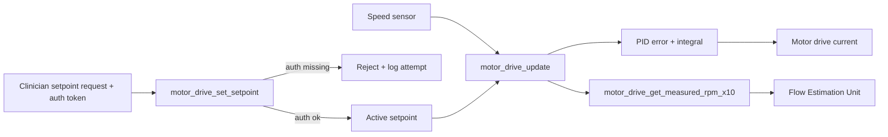

# Motor Drive Control Unit

## Purpose

The Motor Drive Control Unit is responsible for translating a commanded
rotor speed setpoint into motor drive current, and for holding measured
rotor speed within the clinician-prescribed operating range under normal
load conditions. It is the innermost control loop in the pump controller
firmware and the only unit permitted to write motor drive current.

## Design description

The unit implements a PID-style control loop running at an illustrative
100 Hz. On each tick it compares the most recent measured rotor speed
(reported in RPM x10 for one decimal of fixed-point precision) against
the active setpoint, accumulates an integral error term, and computes a
proportional-integral-derivative adjustment to motor drive current. The
gains are tuned to keep steady-state speed within +/-50 RPM of setpoint
under normal load, consistent with SWR-PCF-1.

Setpoint changes are only accepted through `motor_drive_set_setpoint()`,
which requires a `clinician_auth_token_present` flag on the incoming
request. This is a deliberate coupling point with SWR-PCF-6 (reject
unauthenticated setpoint change): the control loop itself refuses to
adopt a new setpoint unless the caller has already validated a clinician
auth token upstream, and the loop will simply continue running the last
accepted setpoint if a request is rejected.

Measured speed is exposed read-only via
`motor_drive_get_measured_rpm_x10()` so that the Flow Estimation Unit can
consume it as one of its two input signals (the other being motor
power draw), without either unit needing to share internal state.

## Interfaces

- Consumes: measured rotor speed (RPM x10) from the motor speed sensor
  driver (not modeled in this repo).
- Consumes: setpoint change requests, gated on clinician auth token
  presence (SWR-PCF-6).
- Produces: motor drive current adjustment (demo stub - not wired to a
  real DAC in this repository).
- Produces: measured rotor speed, read by the Flow Estimation Unit.

## Diagram

