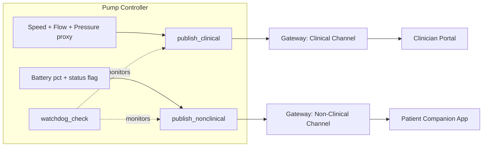

# Telemetry Publisher Unit

## Purpose

The Telemetry Publisher Unit is the pump controller's producer-side
implementation of the Device Telemetry Gateway API. It is the single
point in the firmware responsible for deciding what data crosses each of
the gateway's two channels, and it is therefore also the enforcement
point for the classification boundary between the medical and
non-medical subsystems.

## Design description

The unit maintains two independent publish paths. The clinical-channel
path packages speed, flow estimate, and the filling-pressure-trend proxy
into a `clinical_telemetry_sample_t` and publishes it at an illustrative
1 Hz, matching SWR-PCF-4. The non-clinical-channel path packages only
battery state-of-charge and a coarse status flag
(Nominal/Attention/Charge Now) into a `nonclinical_telemetry_sample_t`
per SWR-PCF-5. The two struct shapes are deliberately different rather
than one struct with optional fields: the non-clinical struct has no
field that could ever carry speed, flow, pressure, or alarm data, so the
allow-list boundary is enforced by the type definition itself rather than
by runtime filtering logic that could have a bug.

At 1.0, this unit had no detection for its own task starving under high
CPU load - if the publish loop missed its cadence, the gateway simply
kept showing the last-known sample with no indication it was stale. This
is FMEA-PCF-4. The 1.0.1 hotfix line (TASK-PCF-2) adds
`telemetry_publisher_watchdog_check()`, which compares the current time
against the last successful publish timestamp on each channel and flags
a staleness condition once it exceeds an illustrative 5-second threshold.
The watchdog closes the control gap but does not change what data is
published on either channel - it only adds a staleness signal.

## Interfaces

- Consumes: flow estimate from the Flow Estimation Unit, speed from the
  Motor Drive Control Unit, battery percentage from the battery monitor.
- Produces: clinical-channel samples to the Device Telemetry Gateway API
  - Clinical Channel (consumed by the Clinician Portal).
- Produces: non-clinical-channel samples to the Device Telemetry Gateway
  API - Non-Clinical Channel (consumed by the Patient Companion App).
- Produces: watchdog staleness flag (1.0.1+), currently device-local;
  not yet surfaced on either gateway channel.

## Diagram

