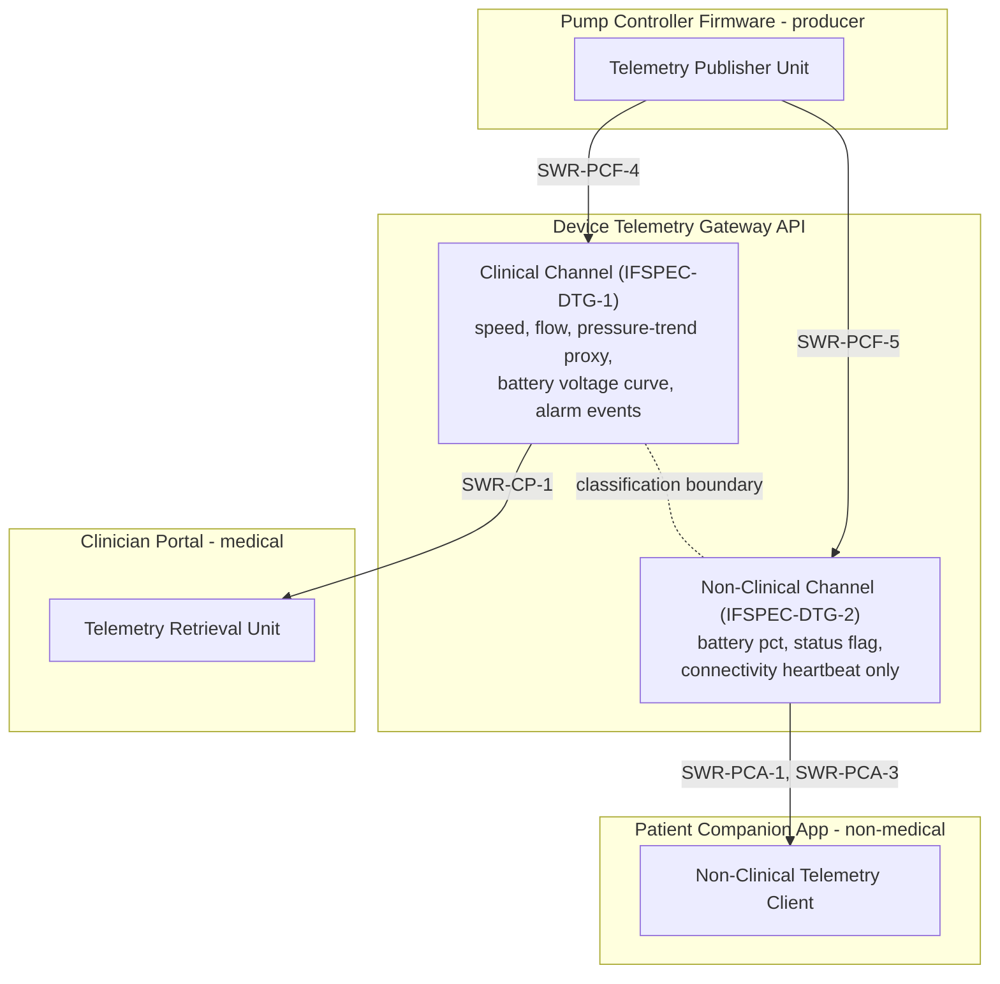

# Device Telemetry Gateway API

## Purpose

The Device Telemetry Gateway API is the single shared interface crossing
the classification boundary of the platform. It lives in the Heart Pump
Digital Platform product project rather than in any one subsystem,
because it is the crossing point, not owned by one subsystem: the Pump
Controller Firmware is the sole producer on both of its channels, the
Clinician Portal consumes the full-fidelity Clinical Channel, and the
Patient Companion App consumes only the filtered Non-Clinical Channel.

This design doc covers both interface specs (IFSPEC-DTG-1: Clinical
Channel, IFSPEC-DTG-2: Non-Clinical Channel) together, since they share
a single wire-format definition in `telemetry-gateway/api-spec.yaml` and
a single design rationale: how the boundary between them is defined and
enforced.

## Design description

The API is modeled as two logically and schematically separate channels
rather than one channel with optional fields. The Clinical Channel
(IFSPEC-DTG-1) carries speed, flow estimate, filling-pressure-trend
proxy, a raw battery voltage curve, and alarm events - full clinical
fidelity, matching SYS-3's rolling operating-parameter log requirement.
The Non-Clinical Channel (IFSPEC-DTG-2) carries only battery percentage,
a coarse status flag (Nominal/Attention/Charge Now), and a connectivity
heartbeat - matching SYS-4's plain-language, non-clinical status
requirement and acting as the enforcement point for SWR-PCA-5 (no
clinical data surfaced) on the Patient Companion App side.

Each schema in `api-spec.yaml` carries an explicit
`classificationBoundaryNote` field, so that the boundary intent is
visible directly in the interface contract and in generated reports/RTM
views, not only in prose documentation. The two schemas are structurally
incompatible with each other by design - there is no cast or projection
from the Non-Clinical schema back to anything resembling clinical data,
because the fields simply do not exist on that side. This is what lets
SYS-8 (isolated non-clinical update pathway) hold under change: because
the Patient Companion App's only data source is a schema that never
carries clinical fields, a change to a clinical-side requirement (like
the low-flow alarm threshold) has no path to reach the companion app
through this interface, regardless of what changes on the producer side.

## Interfaces

- Producer (both channels): Pump Controller Firmware, Telemetry
  Publisher Unit (`pump-controller/telemetry_publisher.c`), implementing
  SWR-PCF-4 (clinical) and SWR-PCF-5 (non-clinical).
- Consumer (Clinical Channel): Clinician Portal, Telemetry Retrieval Unit
  (`clinician-portal/telemetryClient.ts`), implementing SWR-CP-1.
- Consumer (Non-Clinical Channel): Patient Companion App, shared
  telemetry client (`companion-app/nonClinicalTelemetryClient.ts`),
  implementing SWR-PCA-1 and SWR-PCA-3.

## Diagram

